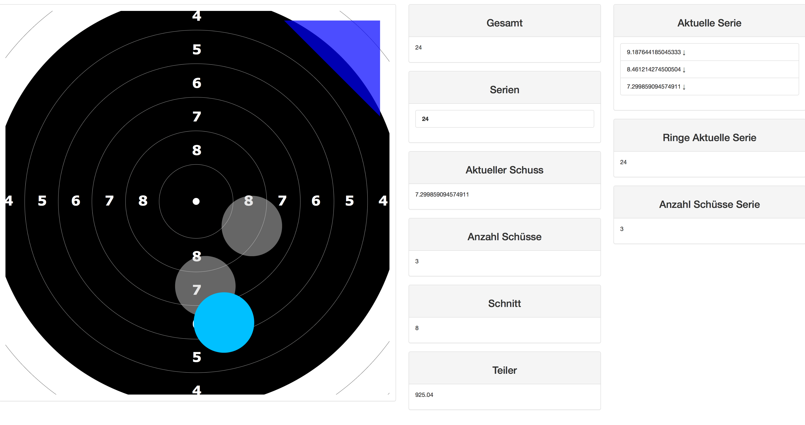

# Shooting-Client (SC)

NodeJS Project to visualize shots on an socket.io based webpage with an API for Häring ESA.



## Install
````
# clone
git clone https://github.com/janniklorenz/Shooting-Client

# open
cd Shooting-Client

# build C++ API
./buildAPI.sh

# NPM install
npm install

# config under
ls config/

# start
node index.js
````


## Links

Scheiben Doku
http://www.sportschuetzengossau.ch/de/images/stories/verein/reglemente_orgainsation/seiten_aus_technische_regeln_2013_2_de_light_a8_teil_1.pdf
